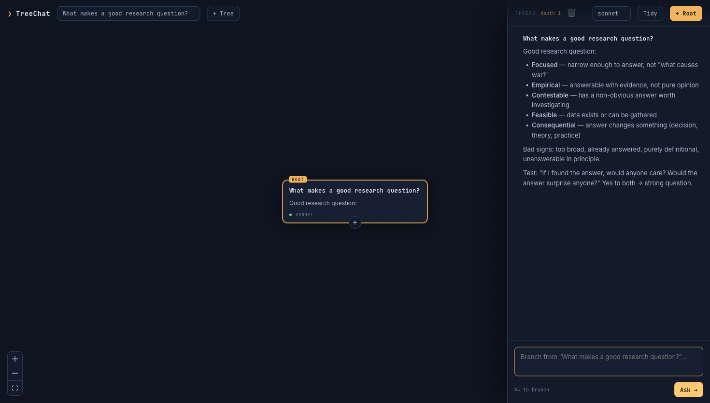

# TreeChat

A local, private **branching-canvas chat** on top of Claude Code. Every Q&A is a
node on an infinite canvas. Branch a question any number of ways, chat from any
node, and TreeChat feeds the **root→node path** (every ancestor Q and A) as context
to the model. Reasoning comes from your local `claude` CLI (your existing
subscription); the tree, history, and layout live in a local SQLite file. Nothing
leaves your machine except the model calls Claude Code already makes.



## Why

Research branches. One answer spawns five follow-ups; each spawns more. Linear chat
flattens that tree into one scroll and loses the structure. TreeChat keeps the tree.

## Prerequisites

- **Node.js ≥ 20**
- **Claude Code** installed and logged in — `claude` must be on your `PATH`.
  TreeChat drives it headless and inherits its auth (no API key needed).

Check: `claude --version` should print a version. The app shows a banner if it
can't find the CLI.

## Run it

```bash
npm install --include=dev    # NODE_ENV=production? the --include=dev is required
npm run build                # bundle the frontend into dist/
npm start                    # serve at http://localhost:5174
```

Then open http://localhost:5174.

### Develop

```bash
npm run dev     # vite (5173) + node --watch server (5174), proxied
npm test        # the one check that matters: path context = root→node, siblings excluded
```

## How it works

```
Browser (React + React Flow canvas)
  │  REST for tree/node CRUD + positions
  │  SSE for streaming a node's answer
  ▼
Node server (Express)  ──  SQLite  (~/.treechat/db.sqlite)
  │  per request, stateless:
  ▼
claude -p --output-format stream-json --no-session-persistence …   (stdin-fed)
```

- **Context = the path.** To answer node X, the server walks X's parent chain to the
  root, concatenates each `Q:/A:`, and sends one fresh `claude -p` call. Siblings are
  never included. Stateless per request — the app owns the context, not the CLI.
- **Storage.** One self-referencing `nodes` table (adjacency list). Positions persist
  on drag; viewport persists per tree in `localStorage`.
- **Privacy.** Everything is local. Model inference is the only network call, and it's
  the same one Claude Code makes for you today.

## Using it

- **+ Root** — plant the first question. The tree auto-names itself from it.
- **+** on any node (or the composer) — branch a follow-up from that node.
- Click a node — open its thread (root→node) on the right; the **active path glows amber**.
- **▽ / ▶** on a node — collapse or expand its branch.
- **Tidy** — auto-layout the tree (dagre). Drag nodes freely; positions stick.
- Model picker (sonnet / opus / haiku / fable) applies to new questions.

## Backends

`server/backend.js` is a driver registry. `claude` is wired; `codex` is a stub —
add its streaming driver there and it plugs into the same contract with no route or
UI changes.

## Data

- Database: `~/.treechat/db.sqlite` (override with `TREECHAT_DIR`).
- Delete that file to start fresh.
